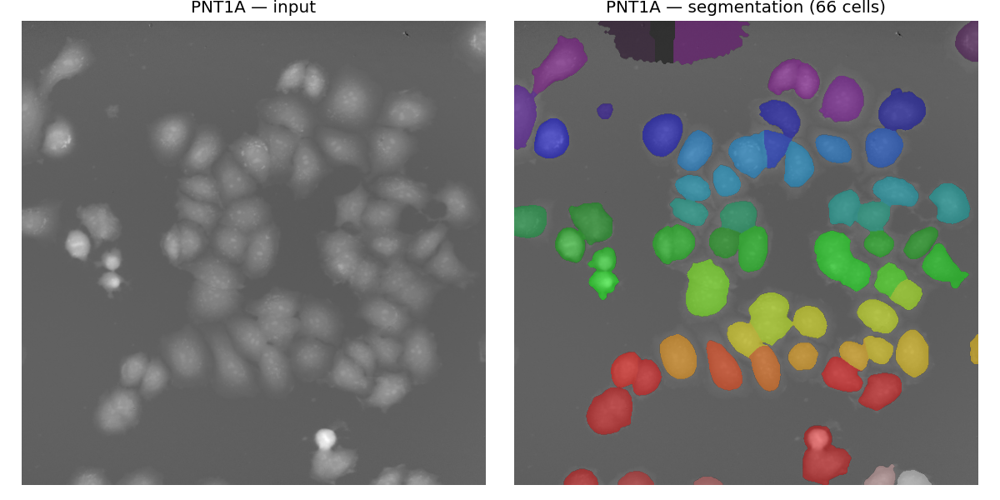
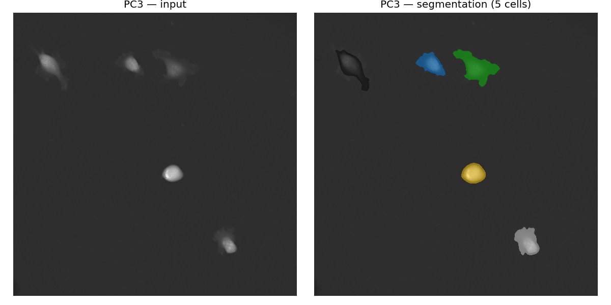
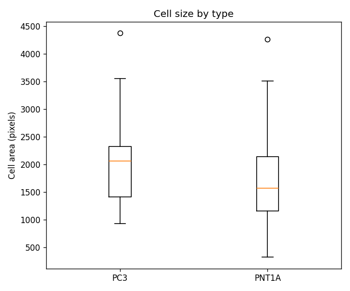

# Image Processing Agent — Showcase

A short demonstration of using an LLM coding agent (Claude Code) as an
**autonomous image-processing assistant**: from a one-line request to a working
pipeline, QC images, and a comparative plot.

---

## The prompt

> *"Try to create a simple script that segments cells in the `testovaci_data`
> folder, extracts their sizes, and plots a boxplot comparing the two cell
> types. Also save an example segmentation for quality control."*

Followed by:

> *"Segmentation is not very good — try some better approach."*

No file paths, no library choice, no parameters. The agent had to figure out
the data layout, pick a segmentation strategy, and iterate on quality.

---

## What the agent did

1. **Explored the workspace** — found that `testovaci_data` did not exist and
   fell back to `data_celltypes/` (4 TIFFs, two cell types: *PNT1A* and *PC3*).
2. **Diagnosed the file format** — LZW-compressed TIFFs; installed the missing
   `imagecodecs` dependency automatically.
3. **Built a first pipeline** — Gaussian blur → Otsu → distance-transform
   watershed. Ran it. Noticed that dim *PC3* cells were lost because Otsu's
   global threshold was too strict for sparse, low-contrast fields.
4. **Iterated on quality** after user feedback:
   - per-image percentile normalization
   - rolling-ball-style background subtraction (large-σ Gaussian)
   - **triangle threshold** instead of Otsu (more permissive for sparse foreground)
   - **`peak_local_max`** seeding for markers → cleaner watershed splits of
     touching nuclei
5. **Reported honestly** — flagged the 3 faintest PC3 blobs still below
   threshold and recommended Cellpose/StarDist for a real fix on dim cells,
   rather than claiming a perfect result.

---

## The pipeline (classical, ~40 lines)

```python
def segment(img):
    lo, hi = np.percentile(img, (1, 99.5))
    norm = np.clip((img - lo) / (hi - lo + 1e-8), 0, 1)

    background = filters.gaussian(norm, sigma=40, preserve_range=True)
    flat = np.clip(norm - background, 0, None)
    smooth = filters.gaussian(flat, sigma=2, preserve_range=True)

    thr = filters.threshold_triangle(smooth)
    fg = smooth > thr
    fg = morphology.remove_small_holes(fg, area_threshold=300)
    fg = morphology.binary_opening(fg, morphology.disk(2))
    fg = morphology.remove_small_objects(fg, min_size=MIN_CELL_AREA)

    seed_src = filters.gaussian(flat, sigma=6, preserve_range=True)
    coords = feature.peak_local_max(
        seed_src, min_distance=10, threshold_abs=thr * 0.5, labels=fg
    )
    marker_img = np.zeros(img.shape, dtype=bool)
    marker_img[tuple(coords.T)] = True
    markers = measure.label(marker_img)

    labels = segmentation.watershed(-seed_src, markers, mask=fg)
    return morphology.remove_small_objects(labels, min_size=MIN_CELL_AREA)
```

Full script — [segment_cells.py](assets/segment_cells.py).

---

## Results

### Quality-control overlays

| Cell type | Overlay |
|---|---|
| **PNT1A** (dense epithelial field) |  |
| **PC3** (sparse, low-contrast) |  |

### Size comparison



| Type  | n  | Median (px) | Mean (px) |
|-------|----|-------------|-----------|
| PC3   | 17 | 2057        | 2112      |
| PNT1A | 84 | 1571        | 1694      |

*PC3 cells are visibly larger but far sparser than the dense PNT1A field — a
biologically plausible result that matches what you see in the raw images.*

### Before vs. after the "try a better approach" iteration

|                | First attempt (Otsu)    | Improved (triangle + BG-sub) |
|----------------|-------------------------|------------------------------|
| PC3 cells found | 19                      | **17** (but full bodies)     |
| PC3 median area | 753 px (eroded masks)   | **2057 px** (accurate)       |
| PNT1A splits    | over-fragmented         | **clean one-per-nucleus**    |

The first run reported *more* PC3 objects but each was a small eroded
fragment. The improved run captures full cell bodies, which is what you
actually want for a size comparison.

---

## What this demonstrates

- **Open-ended task → working pipeline.** The agent handled an under-specified
  request end-to-end: data discovery, dependency install, algorithm choice,
  iteration, and reporting.
- **Self-correction on quality.** When told the output was bad, it *changed
  the method* (threshold, preprocessing, markers) rather than just tweaking
  constants.
- **Honest limitations.** It flagged remaining failures (3 dim PC3 blobs) and
  suggested when a deep-learning tool would be the right next step instead of
  pretending classical methods had won.
- **Small footprint.** One script, standard `scikit-image` stack, no
  heavyweight models — fast to run and easy to audit.

---
