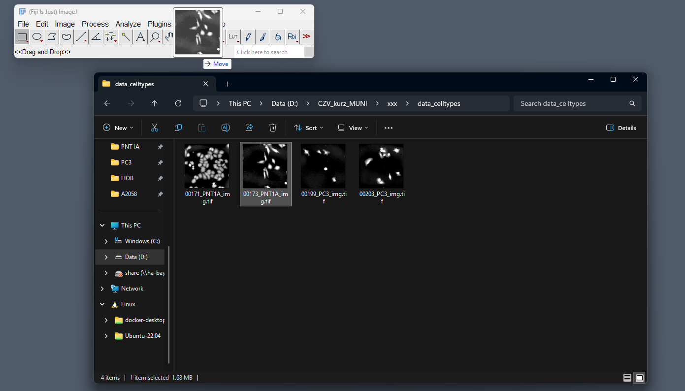
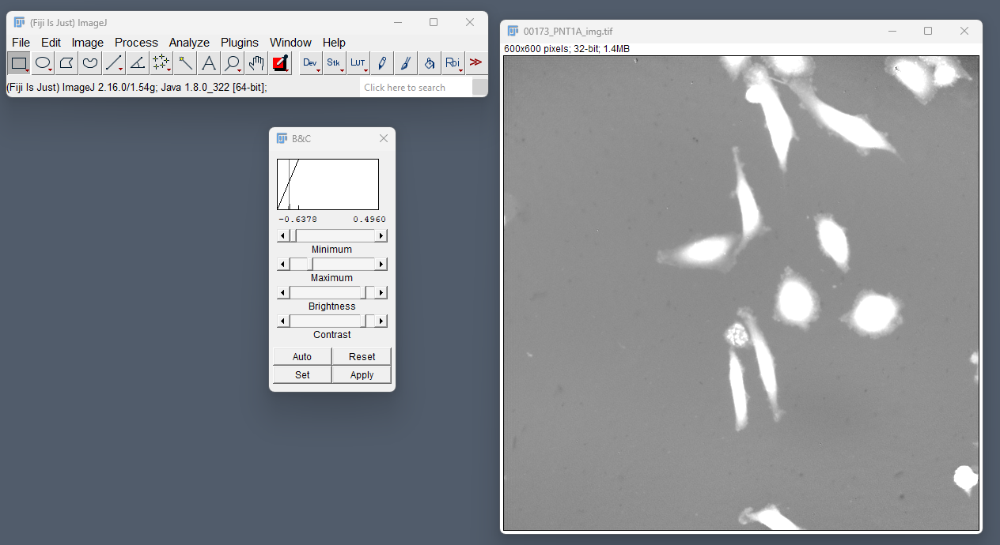
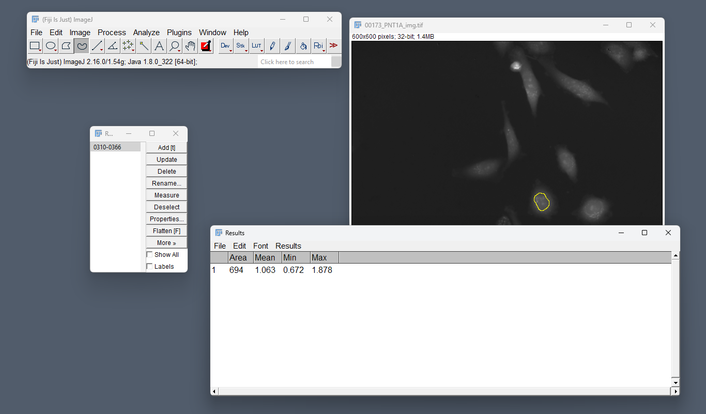
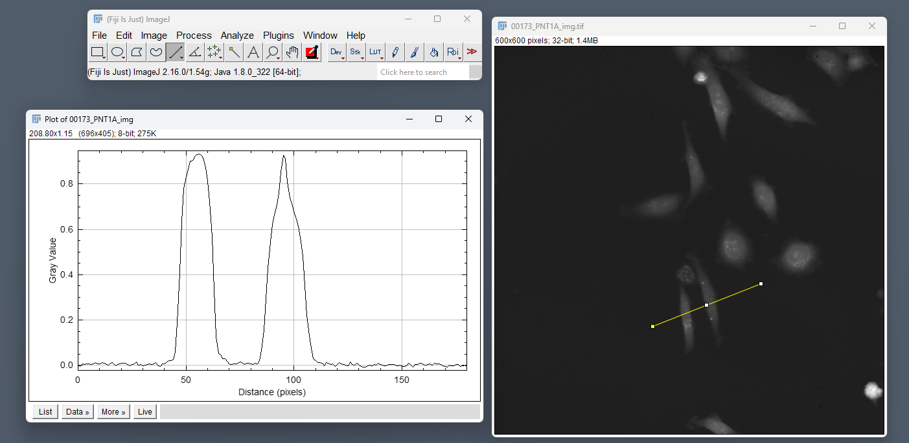
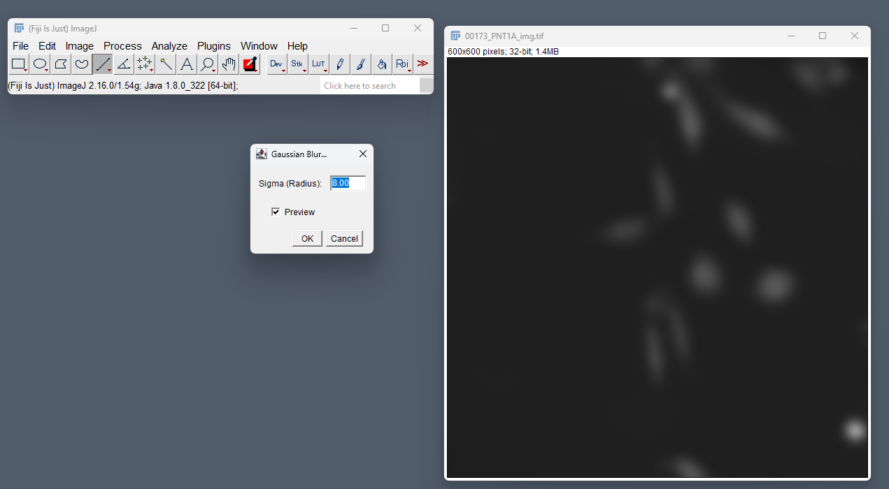
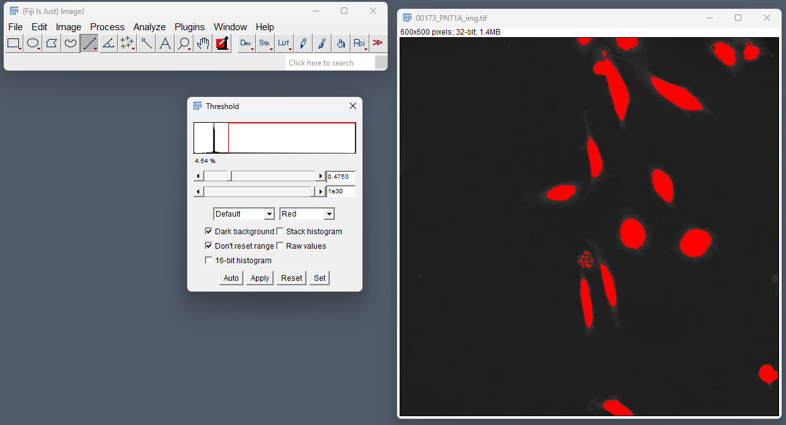
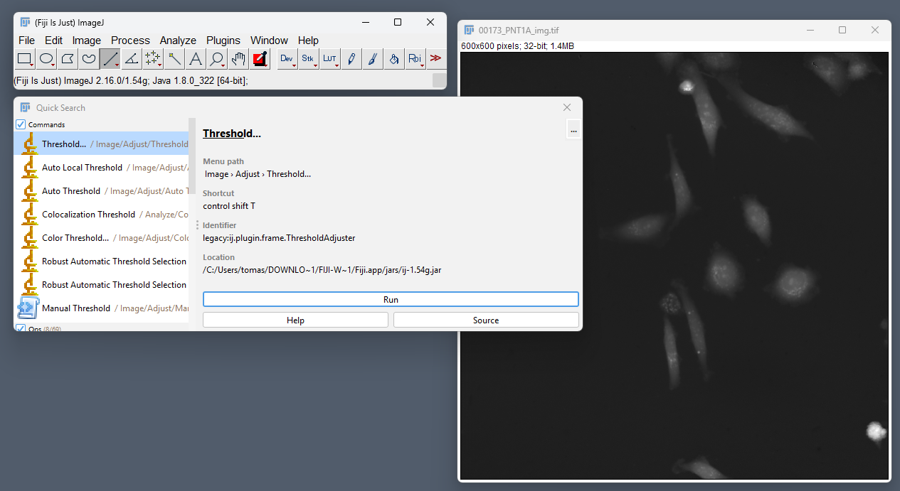
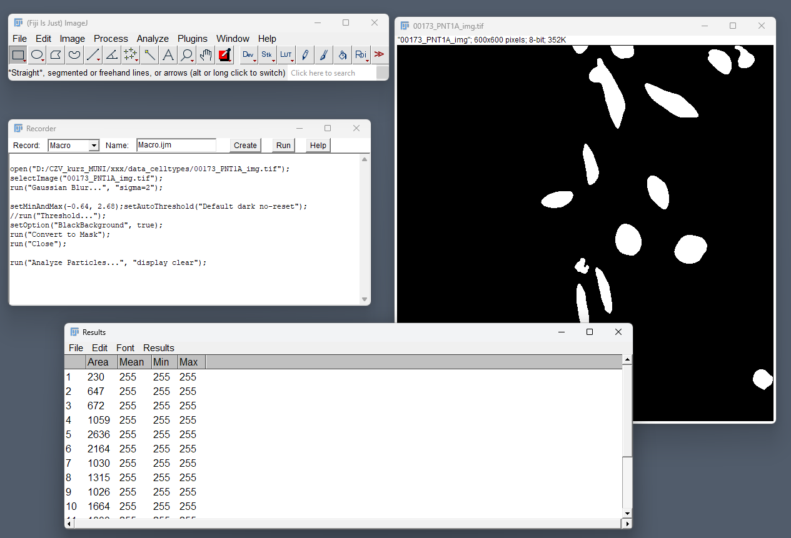

# Základy Fiji — od jednoho kliknutí k makru s pomocí AI

*🇬🇧 [English version](Fiji_basics.en.md)*

Průvodce Fiji pro ty, kteří ho ještě nikdy nepoužili. Končí makrem
vytvořeným s pomocí AI, které zobecní ručně proklikaný workflow do
reprodukovatelného skriptu.

Používáme kurzovní dataset [testovaci_data/](testovaci_data/) — stejné
PNT1A / PC3 TIFFy jako v [ukázce AI agenta](AI_agent_showcase1.md),
takže můžete porovnat klasický Fiji workflow s AI pipeline.

> **Poznámka.** Fiji umí opravdu spoustu věcí — 3D rendering, dekonvoluci,
> tracking, registraci, deep-learning segmentaci, kolokalizaci a mnoho
> dalšího. Tato stránka je jen rychlá ukázka několika základních operací
> pro začátek; zdaleka to není vyčerpávající přehled.

---

## 1. Otevírání obrázků a formáty

File → Open zvládá běžné formáty přímo (TIFF, PNG, JPEG).
Pro mikroskopické formáty (`.lif`, `.czi`, `.nd2`, `.ome.tiff`, …) je ve
Fiji zabudovaný **Bio-Formats**, který formát rozpozná, přečte metadata
(velikost pixelu, kanály, čas) a otevře obrázek jako hyperstack.

> Drag-and-drop funguje taky — stačí soubor přetáhnout na lištu Fiji.

---

## 2. Navigace v obrázku

Zoom: `+` / `-` nebo kolečko myši. Posun: podržte mezerník.
Vícerozměrné obrázky mají dole posuvníky: **c** (kanál), **z** (řez),
**t** (čas).

Image → Properties ukáže velikost pixelu a jednotky — **vždycky to
zkontrolujte před měřením**, jinak všechny velikosti hlásíte v pixelech.

---

## 3. Jas, kontrast a LUTs

Image → Adjust → **Brightness/Contrast** mění, jak se obrázek
*zobrazuje* — skutečné hodnoty pixelů zůstávají beze změny. Tohle je
nejčastější zdroj zmatku pro začátečníky: roztažení histogramu **nemění**
data, na kterých se měří.

LUTs (Image → Lookup Tables) přiřazují barvy intenzitám — užitečné pro
jednokanálovou fluorescenci (Fire, Grays, Green, …).

---

## 4. ROI a měření

Z lišty nástrojů (obdélník, elipsa, polygon, volná ruka, úsečka)
nakreslete oblast zájmu. Otevřete **Analyze → Tools → ROI Manager** a
stiskem `t` výběr uložte — ROI Manager umožňuje regiony znovu použít,
přejmenovat, uložit a hromadně aplikovat.

Přes **Analyze → Set Measurements** si vyberte, co chcete měřit (plocha,
průměr, integrovaná hustota, bounding box, …), pak **Analyze → Measure**
(`m`) vytvoří tabulku výsledků.

---

## 5. Jasový profil

Nakreslete rovnou úsečku přes zajímavé místo a spusťte **Analyze → Plot
Profile** (`k`). Dostanete intenzitu podél úsečky — nejrychlejší kontrola
kontrastu, úrovně pozadí a toho, jestli je hrana skutečná, nebo jen
artefakt komprese.

---

## 6. Filtrace a korekce pozadí

Process → Filters nabízí standardní sadu: Gaussian Blur (potlačení šumu),
Median (odstranění salt-and-pepper šumu), Unsharp Mask (zaostření).

Process → **Subtract Background** (rolling ball) srovná nerovnoměrné
osvětlení — zásadní krok před prahováním, jinak práh zachytí gradient
místo buněk.

---

## 7. Prahování a analýza částic

Image → Adjust → **Threshold** otevře binarizér založený na histogramu.
Vyzkoušejte různé metody v rozbalovacím menu (Otsu, Triangle, Li, …) —
žádná není univerzálně správná, záleží na obrázku.

Jakmile máte masku, **Analyze → Analyze Particles** spočítá komponenty,
změří každou zvlášť a filtruje podle velikosti a kruhovitosti. Výstup:
label image, overlay a tabulka výsledků.

---

## 8. Hledání příkazů — command finder

Fiji má *stovky* příkazů. Stiskněte **`L`**, otevře se command finder a
můžete začít psát — nejrychlejší způsob, jak se v menu zorientovat bez
učení nazpaměť. **Help → Search…** prohledává dokumentaci a fórum ImageJ.

> Pokud si máte zapamatovat jen jednu klávesovou zkratku, ať je to `L`.

---

## 9. Pluginy a update sites

Help → Update… → **Manage update sites** vám na jedno kliknutí dá
komunitní sady nástrojů:

- **MorphoLibJ** — pokročilá morfologie, watershed, operace s label-mapami
- **BioVoxxel** — nástroje pro analýzu obrazu a rozšířená particle analysis
- **3D ImageJ Suite** — 3D segmentace a měření
- **StarDist**, **CSBDeep** — deep-learning segmentace

Zaškrtněte site, klikněte Apply Changes, restartujte Fiji. Plugin se
objeví v menu.

---

## 10. Nahrávání makra

Plugins → Macros → **Record…** otevře okno rekordéru. Každé kliknutí,
každý dialog, každý parametr, kterého se dotknete, se zachytí jako řádek
ImageJ makra. Proklikejte workflow jednou, pak File → Save As → `.ijm`.

Tím se z jednorázového proklikávání stane reprodukovatelný skript — a
zároveň je to nejlepší způsob, jak se naučit macro API: prostě něco
udělejte a přečtěte si, co Record napsal.

---

## 11. Psaní makra s pomocí AI

Record je skvělý na *zachycení* sekvence, ale výsledný skript bývá
ukecaný, napevno svázaný s jedním obrázkem a těžkopádný na zobecnění.
Tady pomůže LLM kódovací agent:

- **Popisujte cíl, ne kliky.** *„Pro každý .tif v této složce odečti
  pozadí (rolling ball 50), naprahuj Triangle, spusť Analyze Particles
  s plochou 50–5000 a zapiš výsledky do jedné CSV."*
- **Předejte mu výstup Record jako startovní bod.** Agent uvidí přesné
  volání API a zobecní je do smyčky.
- **Specifikujte dialekt.** Řekněte *„ImageJ macro language (.ijm), ne
  Groovy"* — Fiji podporuje několik skriptovacích jazyků a modely je
  občas zaměňují.
- **Ověřte spuštěním.** Vygenerované makro berte jako návrh. Fiji je
  tolerantní — spusťte ho nejdřív na jednom obrázku, pak teprve škálujte.

Je dobré znát limity: LLM občas halucinují mezi API ImageJ 1 a ImageJ 2
nebo mixují macro syntaxi s Jythonem/Groovy. Pokud některý řádek vypadá
podezřele, ověřte ho nahráním stejné akce ručně.

---

## Co si z toho odnést

- Fiji je **vizuální prototypovací prostředí** — proklikejte, dokud
  workflow nefunguje, pak ho převeďte do makra.
- **Brightness/contrast mění zobrazení, ne data.** Měří se na surových
  pixelech.
- **Vždy zkontrolujte velikost pixelu** před hlášením měření.
- `L` najde jakýkoli příkaz. Update sites dodají zbytek.
- **Record + AI** je produkční smyčka: jedno proklikání se během minut
  promění v reprodukovatelný, zobecnitelný skript.
